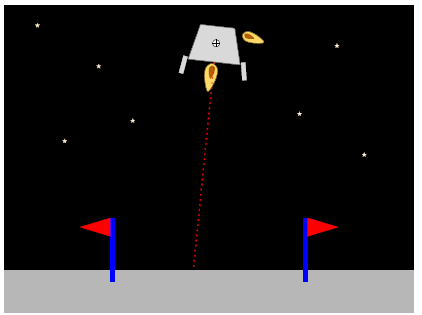
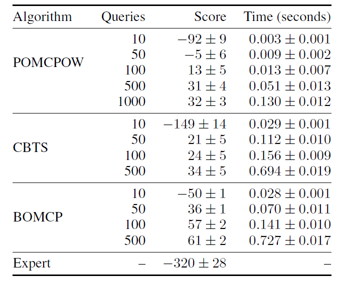
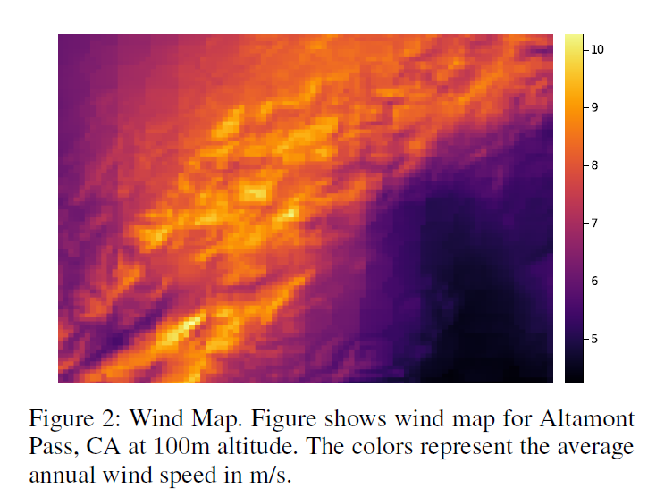
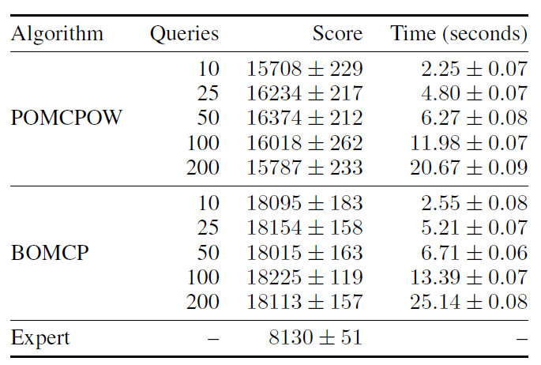
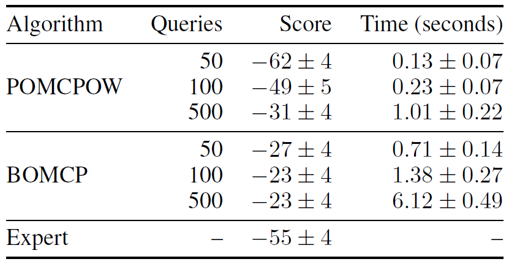
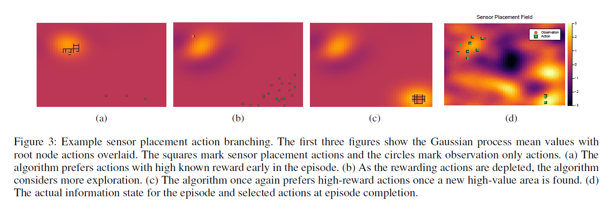
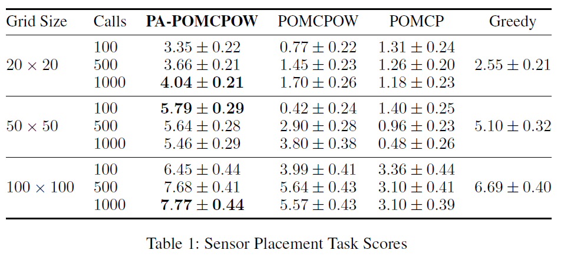
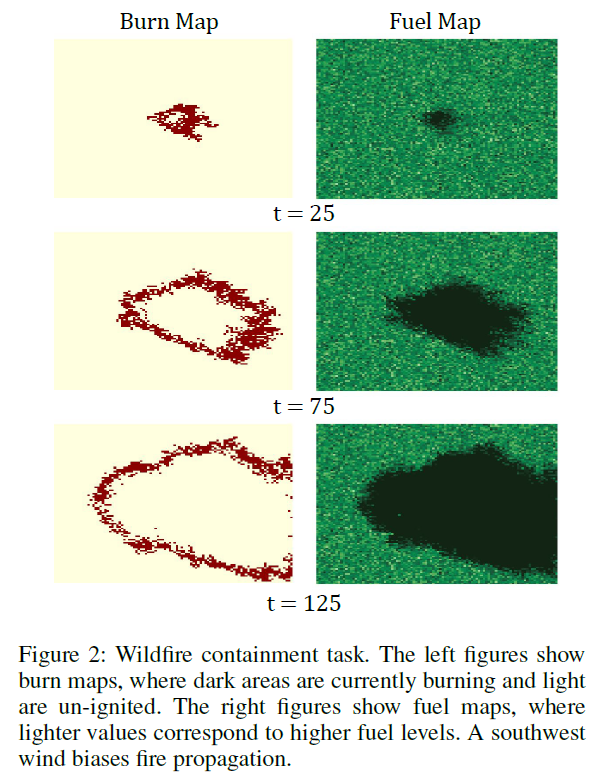
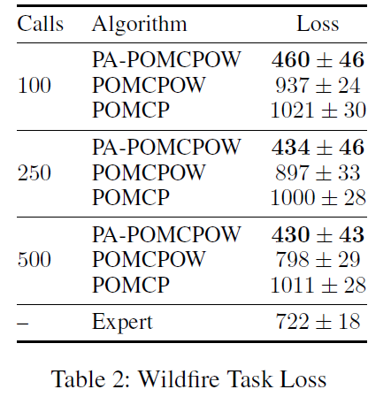

# BOMCP and PA-POMCPOW

> 此文主要介绍AAAI上两篇解决连续动作空间POMDP的论文。

## Bayesian Optimized Monte Carlo Planning

此篇文章提出基于POMCPOW的BOMCP算法用于解决连续动作空间上的POMDP问题，其借鉴了POMCPOW使用**PW离散化**观测空间的思路，将PW离散化应用在动作空间中，然而由于离散**后的动作分支是从整个动作空间中随机选择的，对整体的动作价值分布的估计效果极差**，至少需要使用专家策略来抽样选取动作分支，才能达到勉强可接受的效果。

因此此文主要是用于解决**PW离散化中动作分支的选择问题**。

------

BOMCP的**创新之处**：

1. **使用贝叶斯优化框架指导动作分支的选择**，在此框架下，优化目标是选择后续MCTS搜索返回的动作值中**预期改善程度**最高的动作(最能提高子节点集合的最大值的动作)：

$$
\text{EI}(a|b):=E_{Q\sim GP}[|\hat Q(b,a)-\hat Q(b,a^*)|^+]\label{1}
$$

​		其中$|x|=\text{max}(x,0)$，b表示信念状态，a表示动作。

2. EI的期望值与未知函数Q(b,a)的分布有关，因此BOMCP使用**高斯过程(GP)来建模Q(a,b)函数**分布，根据高斯过程的定义和性质，$\eqref{1}$​​​可以被改写为：

$$
\begin{aligned}
\mathrm{EI}(a \mid b)=&|\Delta(b a)|^{+}+\sigma(b a) \phi\left(\frac{\Delta(b a)}{\sigma(b a)}\right) \\
&-|\Delta(b a)| \Phi\left(\frac{\Delta(b a)}{\sigma(b a)}\right)
\end{aligned}
$$

​		其中$\Delta(b a)=\mu(ba)-\hat Q(b,a^*)$，$\mu(ba)$和$\sigma(ba)$是GP后验的均值和标准差。$\phi$和$\Phi$​​是标准正		态概率密度和累积密度函数。

​		同时根据高斯过程有：

​		
$$
\begin{array}{l}
P\left(\mathbf{y}^{*} \mid \mathbf{y}, \mathbf{x}, \mathrm{x}^{*}\right)=\mathcal{N}\left(\mathbf{y} \mid \mu^{*}, \Sigma^{*}\right) \\
\mu^{*}=m\left(\mathrm{x}^{*}\right)+\Sigma_{x^{*} x}\left(\Sigma_{x x}+\mathbb{I} \sigma^{2}\right)^{-1}(\mathbf{y}-m(\mathrm{x})) \\
\Sigma^{*}=\Sigma_{x^{*} x^{*}}-\Sigma_{x^{*} x}\left(\Sigma_{x x}+\mathbb{I} \sigma^{2}\right)^{-1} \Sigma_{x^{*} x}^{\prime}
\end{array}
$$
​		因此对于任何动作a(包括那些未被采样的动作)，EI(a|b)都是**可求**的。

​		在BOMCP中，为了使用高斯过程(GP)，输入必须表示为向量，因此定义函数**VECTORIZE**将信		念动作对(b,a)转化为向量表示ba。**由于高斯过程很难处理大型数据，因为它的复杂度$O(n^3)$。**		因此，BOMCP使用**k-最近邻方法**，仅考虑每个后验计算中最近观测点的影响，将$N$x$N$协方差		矩阵更改为$K$x$K$，其中$K\ll N$。

3. **由于根节点处的动作分支对整个搜索树的表现至关重要，因为其中某个动作将被返回给Agent。**然而由于贝叶斯优化要求现有的节点估计是非常准确的，但是树刚开始构建时的节点评估都是非常不准确的，因此BOMCP**引入了一个经验缓冲区B**，，其中包含来自先前规划步骤的信念操作节点。该缓冲区中的观测值与当前树节点一起用于构建高斯过程。缓冲区在计划结束时随机重新填充。

------

BOMCP在三个连续观测问题上做了相关的实验，**结果如下：**

- ### Partially Observable Lunar Lander

**状态空间：** : 水平偏差距离x  垂直下降距离y  着陆角度$\theta$  水平速度$v_x$  垂直速度$v_y$  角速度$\omega$​

**动作空间：**沿垂直轴通过质心的主推力T  沿水平轴方向修正推力$F_x$​​，其与质心存在一段距离$\sigma$

**奖励函数：**
$$
r\left(s, a, s^{\prime}\right)=\left\{\begin{array}{ll}
-1000, & \text { if } x \geq 15 \vee \theta \geq 0.5 \\
100-x-v_{y}^{2}, & \text { if } y \leq 1 \\
-1, & \text { otherwise }
\end{array}\right.
$$
奖励函数中的第一项为进入不可恢复状态的车辆提供惩罚。第二项为着陆车辆提供正奖励，减去偏离中心和碰撞速度的惩罚。最后一项是对燃油消耗的持续惩罚。

**实验结果：**

**可以看出BOMCP在任意Queries(根节点到叶节点的完整路径数量)下的表现都比另外两种算法好，但是花费的时间成本也较高。**

作者在POMCPOW上运行了一组额外的测试，每次搜索1000个查询。对于1000个查询，POMCPOW花费的时间与BOMCP处理100个查询所花费的时间一样多。BOMCP在100次查询时的表现仍然优于POMCPOW在1000次查询时的表现，每次搜索都需要大约0:13秒的时间。**这可以证明BOMCP的性能提升来自于对动作分支的合理选择而不是额外的计算时间。**

- ### Wind Farm Planning

  

**目标：**Agent按顺序选择在大型三维风场中安装传感器塔的位置。目标是生成大风区域的精确地图，稍后用于规划涡轮机布局。

**状态空间：**风场中离散位置处**年平均风速**的三维风图表示，如图2所示。区域的地图是一个20 x 20 x 3阵列，覆盖海拔50米、100米和150米的4440x4440区域。除了风图，**状态还包含所有先前放置的传感器塔的位置。**

**动作空间：**在每个时间步，Agent可以选择将传感器塔放置在地图上任何未占用的网格位置，三个高度中的任何一个。因此，操作空间最多包含1200个不同的操作。Agent接收到每个传感器塔位置的风值的无噪观测，但不接收其他位置的风值。一个感应塔观察所有高度及其以下的风值。

**奖励空间：**奖励是通过首先将当前信念传递给涡轮机布局优化器生成的。优化器通过贪婪地选择具有最大1-$\sigma$​低置信界的位置来产生一个风险敏感的涡轮机布置。然后，根据真实风场状态，使用生成的布局估算年总发电量。每座塔的额外成本与其高度成线性比例。通过这种方式，奖励鼓励传感器布置，以减少大风地区的差异。

**实验结果：**

对于这个大型离散动作空间问题，BOMCP的表现明显优于POMCPOW。BOMCP和POMCPOW似乎都在大约50个查询时达到了最高性能。POMCPOW的性能从未超过BOMCP的性能。对于单个Query，BOMCP仍然比POMCPOW执行得更好。**这可能是由于BOMCP经验缓冲区，它允许BOMCP选择较好的操作，而POMCPOW只能随机采样。**

- ### Cyber Security

**目标：**其中**Agent扫描网络上的节点以检测和消除正在传播的恶意软件感染**。 选择此任务是因为高斯过程观测值之间的距离度量不那么明显，**用于测试 BOMCP 对更难表示空间的鲁棒性**。网络由一组局域网 (LAN) 组成，其中每个 LAN 是一组完全连接的主机节点和一个服务器节点。 服务器节点之间的边是随机生成的，尽管图被限制为完整的。 该网络还包含一个特殊的“保险库”服务器节点，即恶意软件目标。
**状态空间：**状态由单个节点的感染状态以及边缘拓扑表示。 每个 LAN 有 4 个 LAN 和 10 个主机节点。 感染根据已知的随机对手策略传播。
**动作空间：**  每一步，Agent都可以扫描单个 LAN 上的每个节点或扫描单个节点。 扫描 LAN 时，Agent以 0.3 的概率在所有 LAN 节点上检测到恶意软件。 在扫描单个节点时，Agent以 0.5 的概率检测到恶意软件并以 0.8 的概率清除它。如果保险库节点被感染或经过 250 个时间步长，则过程终止。 Agent在非终端步骤中不会获得奖励。 对于终端步骤，奖励函数为：
$$
r\left(s, a, s^{\prime}\right)=\left\{\begin{array}{ll}
-100-0.5\left|S_{i}\right|-0.1\left|H_{i}\right|, & \text { if vault infected } \\
-0.5\left|S_{i}\right|-0.1\left|H_{i}\right|, & \text { otherwise }
\end{array}\right.
$$
**实验结果:**

其中 Si 是受感染服务器节点的集合，Hi 是受感染主机节点的集合。与之前的实验一样，对于给定数量的Queries，BOMCP 的性能优于 POMCPOW，但每次查询的成本更高。

### 总结

BOMCP解决了在连续动作空间问题中。将PW用于MCTS中而出现的**动作分支选取问题**。其主要思想是使用**贝叶斯优化框架指导动作分支的选择**，**在其中使用高斯过程建模函数分布Q(b,a)**，并使用k-最近邻方法降低计算成本，同时**引入缓冲经验区B**，利用先前规划中的动作价值来减小根节点处动作分支评估的偏差。

实验表明BOMCP在大规模离散动作空间和连续动作空间上取得了不错的性能，但是计算成本较高，且高斯过程中的超参数对性能影响较大。

------

## Improved POMDP Tree Search Planning with Prioritized Action Branching

本篇文章基于POMCPOW提出PA-POMCPOW用于解决连续动作空间任务，其将DPW应用于动作空间上，同样提出了一种方法用于选择动作分支。

PA-POMCPOW提出了提出了一种从完整动作空间中选择最有希望的动作子集的方法。 然后，树中的探索仅限于这个较小的子集， 根据评估**每个动作的预期一步奖励和信息增益的评分函数**来选择这个子集。 

#### 动作评分函数

为了选取动作子集，PA-POMCPOW建议**将动作根据动作评分函数排序**，并将得分最高的动作加入子集中。
$$
k(a, b ; \lambda)=\mathbb{E}_{s \sim b}[r(s, a)]+\lambda I(b, a)
$$
其中a是动作，b是状态信念分布，I(b,a)是信息增益项，$\lambda$​​是权重参数。**评分函数中的信息增益项对于允许Agent探索非短视轨迹很重要。**

一般分布的信息增益是很难有效计算的。 假设信念在每个时间步都是无偏的，其通过熵减少来近似信息增益为：
$$
\begin{aligned}
I G\left(b^{\prime}, b\right) &=\mathrm{H}(b)-\mathrm{H}\left(b^{\prime}\right) \\
& \approx \frac{1}{2} \log \left((2 \pi e)^{d}\left|\boldsymbol{\Sigma}_{b}\right|\right)-\frac{1}{2} \log \left((2 \pi e)^{d}\left|\boldsymbol{\Sigma}_{b^{\prime}}\right|\right) \\
&=\frac{1}{2}\left(\log \left(\left|\boldsymbol{\Sigma}_{b}\right|\right)-\log \left(\left|\boldsymbol{\Sigma}_{b^{\prime}}\right|\right)\right) \\
&=\frac{1}{2}\left(\operatorname{Tr}\left(\log \left(\boldsymbol{\Sigma}_{b}\right)\right)-\operatorname{Tr}\left(\log \left(\boldsymbol{\Sigma}_{b^{\prime}}\right)\right)\right)
\end{aligned}
$$
其中H是信息熵，$\boldsymbol{\Sigma}_{b}$是置信分布b的协方差，$\boldsymbol{\Sigma}_{b'}$是更新后信念b’的协方差，Tr是矩阵迹。 因此：
$$
I(a, b)=\operatorname{Tr}\left(\log \left(\boldsymbol{\Sigma}_{b}\right)\right)-\operatorname{Tr}\left(\log \left(\mathbb{E}_{b^{\prime}}\left[\boldsymbol{\Sigma}_{b^{\prime}}\right]\right)\right)
$$
**注意其中b'使用了期望形式。**

因为会为每个动作节点评估分数，所以它的评估需要快速。 

此文使用了一些方法用于快速评估，例如在某些特殊情况下，使用解析解准确计算动作分数；

在无法获得解析解的情况下，可以使用近似值，例如通过局部线性化。

#### 期望奖励项

$$
\mathbb{E}_{s \sim b}[r(s, a)]=\int r(s, a) b(s) d s
$$

为了快速的评估此项，此文介绍了一些方法如下：

对于连续情况，对于奖励函数和信念分布的特殊组合，积分的解析解存在。例如，与状态呈线性关系的奖励函数允许在已知的第一时刻为任何分布找到解析解。也就是说，给定一个形式的奖励函数
$$
r(s,a)=\boldsymbol{s^Ta}(a)+c(a)
$$
其中**s**是状态的向量表示，向量a和标量c是动作a的函数，因此期望奖励可计算为
$$
\mathbb{E}_{s \sim b}[r(s,a)]=\boldsymbol{\mu_s^Ta}(a)+c(a)
$$
其中$\mu_s$​是状态信念分布的平均值。基于高斯分布的信念，线性、二次、三次和四次的奖励函数都有已知的解。（Petersen和Pedersen，2008）。

#### 期望信息增益项

可定义为：
$$
\begin{aligned} \mathbb{E}_{b^{\prime}}\left[\Sigma_{b^{\prime}}\right] &=\int_{o} \Sigma_{\rho(b, a, o)} \int_{s} P(o \mid s, a) b(s) d s d o \\ &=\int_{o} \Sigma_{\rho(b, a, o)} \mathbb{E}_{s \sim b}[P(o \mid s, a)] d o \end{aligned}
$$
其中b’是采取行动a并接受观察o后的信念。对于有限离散状态空间和观测空间的特殊情况，信息增益项可以精确地计算为分布的总和。

此文为了快速的计算增益项，**限定观测模型为线性高斯，且信念b也为高斯**，则转换函数$\rho$(b;a;o)也是高斯的。此时结果分布的平均值为$\boldsymbol{Bs+d}$，协方差为$\boldsymbol{B\sum_sB^T+\sum_o}$（Kalman 1960)，其中$\boldsymbol{\sum_s}$为信念协方差，而$\boldsymbol{\sum_o}$为观测噪声协方差，可能是动作的函数。B矩阵和d向量分别是仿射转移矩阵和偏差向量的集合。

用高斯过程（GP）对信念建模也可求出解析解。给定高斯过程，信念分布为高斯分布，其参数由GP的后验值计算。如果我们将GP的可观测点限制在状态元素上，则**方差减少与可观测元素的边际方差成正比**。信息增益然后降低到
$$
I(a,b) \propto \boldsymbol{\sum_b}[o_x]-\sigma_o
$$
其中，$o_x$是观测点协方差矩阵的指数，$\sigma_0$是边际观测噪声。

### 动作选择

此文设计了两种动作选择的方法：

- 一种是针对如POMCP算法，**在单个步骤中加入子集中所有的动作**。为了选择子集，作者生成了一组非负数$\Lambda$，令$\lambda_i \in \Lambda$，则子集$\tilde A \leftarrow\{a_i,...,a_N\}$由此生成：
  $$
  a_i \leftarrow \arg\max_{a\in A} k(a,b;\lambda_i)
  $$
  以这种方式选择动作将产生一个子集，该子集沿着多目标动作分数的帕累托边界存在，平衡奖励获得和探索。

- 一种是针对如POMCPOW算法，在单个步骤中只生成单个$\lambda$​值，并将取得最大分数的单个动作加入树中。为了保持规划器行为的渐近收敛，**没有对添加节点的总数施加上限**

这些选择方法可以应用于任何在动作上明确分支的树搜索方法，因为只需要一个依赖于奖励函数的评分函数。 **然而这些方法仅对具有非稀疏奖励的任务有效**，对于不是这种情况的任务，可以使用有形奖励函数代替任务奖励来评估动作分数。

------

PA-POMCPOW在两个实验上进行了测试，**其中Sensor Placement具有静态环境状态和密集奖励。 Wildfire Containment具有动态环境状态和稀疏奖励。**

- ### Sensor Placement

  

传感器放置任务需要Agent依次选择位置以在大型 2D 网格世界中安装传感器，以最大限度地收集信息。 世界上的每个位置都有不同的信息集中度。信息密度是通过从每个坐标处具有零均值和线性指数协方差内核（Kochenderfer 和 Wheeler 2019）的先验高斯过程采样生成的。

**状态空间**：$S = (S_g;S_s)$，其中 $S_g$ 是信息网格图，$S_s$ 是放置传感器的坐标列表。 每一个episode的信息场都是静态的，传感器的位置是确定性的。 该字段由放置在网格上随机点的一组传感器初始化，这些点的值是已知的。

**动作空间：**在每一步，Agent选择放置传感器或观察的位置。 Agent可以在网格上选择一个点，该点距离先前放置的传感器至少有$\sigma$个单元格。如果放置了传感器，则Agent会收到等于该单元格信息值减 1 的奖励。 没有放置传感器而选择观察则没有奖励。 由于Agent可以在每个网格单元上观察或放置一个传感器，所以动作空间的大小等于网格单元数量减去禁止空间数量的两倍。 我们考虑了大小为 (25x25)、(50x50)、(100x100) 的网格，分别对应于 1250、5000 和 20000 的最大动作空间大小。

Agent每次采取行动时，它都会直接观察放置传感器的单元格的值。 放置 T 传感器后，该事件终止。 为了解决这个任务，我们使用了高斯过程来对信念进行建模。 在每一步，通过将观察到的位置和值附加到 GP 参数来更新信念。

我们通过解决三种不同网格大小的问题来测试 PA-POMCPOW，每种网格大小有 100 种不同的初始化。 向量$\Lambda$​被设置为 0 到 2 之间的线性间隔值，步长为 0.1，总共考虑 20 个动作。

**实验结果：**

PA-POMCPOW在所有测试点上都优于基线算法。除一个测试点外，它在所有测试点上的表现都优于贪婪策略，这表明对于动作子集，树搜索仍然能够找到非短视策略。在任何情况下，基线的表现都不如贪婪策略。

- ### Wildfire Containment

**任务描述：**在此任务中，火势蔓延到网格世界。 Agent必须选择网格中的区域来清除燃料，以控制野火的蔓延。火的传播是概率性的。 该任务旨在测试 PA-POMCPOW 在具有非平稳动态和稀疏奖励的任务上的性能。

在此模型中，火从网格中的某些点开始并在这些点燃烧，直到燃料耗尽。 当前未燃烧的含燃料网格点燃的概率与其当前燃烧的相邻网格的数量成正比。 火能够蔓延到直接相邻的单元格之外，最多两个单元格。风会使火的传播方向发生偏差，并且每一步都会随机变化。

**状态空间：** **状态由燃烧图、燃料图和风向量表示**，如图 2 。燃烧图是网格世界中的单元着火的数组。 燃料图是每个单元格中包含多少燃料的数组，它是通过从截断的高斯分布中对每个单元格进行采样而生成的。风在网格上是均匀的，向量是从 [-1,1] 之间的二维均匀分布中采样的。

网格每个角的区域被指定为禁区。 与每个区域相关联的是一个计数器 $c_i$，它在每个时间步减少，直到它达到零。 任务的目标是防止火势到达任何禁区，直到区域计数器为零。 如果火势到达禁区，则该区域的计数器直接设置为零，奖励等于剩余的计数器值 $c_i$​。 当所有区域的计数为零时，episode终止.

**动作空间：**在每一步，Agent选择一个不燃烧的网格单元来清除燃料。 然后将所选网格和八个周围网格中的燃料水平设置为零。 通过添加零均值高斯噪声来更新风向量。
Agent完全了解燃烧图、燃料图和禁止计数器。 Agent还会对风进行嘈杂的测量。 风测量上的噪声与动作位置与火源之间的距离成正比。 火到达任何禁区的成本等于禁区计数器值的十倍。

为了解决这个任务，我们使用高斯分布对风的信念进行建模，并使用卡尔曼滤波器 (Kalman 1960) 对其进行更新。 该集合由 0.5 和 1.5 之间的线性间隔值组成，步长为 0.1，总共 16 个值。 然而，使用了得分函数的线性高斯形式，因为奖励是稀疏的，所以实施了密集的、成形的奖励。 形状奖励函数被定义为$ r(a; s) =\theta df (a) +\beta dk(a)$，其中 $df $测量清除网格到最近燃烧网格的距离，$d_k(a)$是到最近禁区的距离。$\theta$ 和$\beta$​​是加权因子。
 在网格大小为40x40的情况下，我们运行每个测试，每个求解器步骤的模拟器调用限制为100、250和500。对于每次运行，我们记录了每一步的总累积奖励和平均规划器运行时间。 与传感器放置任务一样，我们也对 POMCP 和 POMCPOW 基线算法进行了每个测试，使用相同的置信度分布和求解器调用次数。
我们还实施了短视专家政策，清除与每个禁区接壤的所有燃料。在每一步，该策略都会立即清除与禁区接壤的单元格，以便在该区域周围创建屏障。 该策略选择清除离火最近的禁区的单元格，直到所有边界单元格都被清除。 然后它移动到下一个最近的区域。

**实验结果：**

**PA-POMCPOW 在所有三个测试场景中都能够胜过基线算法和专家策略**。专家政策的表现优于两个基线。野火任务的计算成本略高于传感器放置任务的计算成本。  PA-POMCPOW 的每次查询时间为 11.6 毫秒，POMCPOW 为 8.5 毫秒，POMCP 为 8.2 毫秒。 和上一个任务一样，PA-POMCPOW 比 POMCPOW 和 POMCP 的成本更高。尽管环境更复杂，奖励函数稀疏，但 PA-POMCPOW 仍然能够比现有的最新技术和专家策略更好地解决问题。

### 总结

PA-POMCPOW提出了一种从动作空间中静态选择动作子集以用于MCTS的方法，结果表明在大型离散动作空间任务上取得了不错的性能，**然而静态的动作子集可能会限制算法的性能**，且此方法虽然原则上可用于连续动作空间，但毕竟没有在连续动作空间任务上使用，**生成连续动作空间上的评分函数是非常困难的**，因此其在连续动作上的性能难以得到保证。

