# POMDP值函数的分段线性表示

> **导语**：POMDP信念在最优策略下的值函数为分段线性凸函数(PLWC)，其可以由直线/超平面所表示(也就是常说的$\alpha$-vector)。本篇笔记通过讲一个简单的例子来理解为什么值函数可以由直线/超平面所表示，使用的资料链接如下。
>
> 英文资料链接：http://cs.brown.edu/research/ai/pomdp/tutorial/pomdp-vi-example.html
>

## 正文：

首先简单介绍一下POMDP模型：

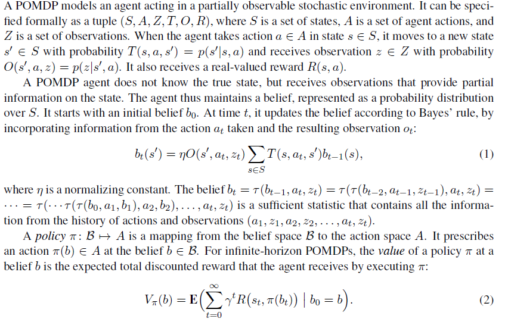

其中，最优策略下的值函数(即获得最高奖励的策略)根据贝尔曼方程计算：
$$
V^{*}(b)=\max _{a \in A}\left\{\sum_{s \in S} b(s) R(s, a)+\gamma \sum_{z \in Z} p(z \mid b, a) V^{*}(\tau(b, a, z))\right\},
$$
**为了简化讲解，我们定义一个简单的POMDP模型**：**2个state，2个action，3个observation**

------

## 一  **Horizon=1**

首先我们考虑Horizon=1时的值函数(指**最优值函数**)。

由于Horizon=1，因此我们不需要考虑未来的汇报，只需要考虑即时的奖励即可，此时值函数的更新公式为：
$$
V^{*}(b)=\max _{a \in A}\left\{\sum_{s \in S} b(s) R(s, a)\right\},
$$
由于我们有**两个状态**和**两个动作**，因此有**四个独立的即时奖励值**，即$R(s_1,a_1) ,R(s_1,a_2), R(s_2,a_1) ,R(s_2,a_2) $。

同时，因为信念(belief)为状态空间的概率分布，因此我们只需将belief中state的概率分布作为奖励的权重即可。

例如：令$R(s_1,a_1)=1 ,R(s_1,a_2)=0,R(s_2,a_1)=0 ,R(s_2,a_2)=1.5$。

如果我们的belief是[0.25 0.75]，那么在这个信念状态下执行动作$a_1$的值是：

​													$0.25 \times 1+0.75 \times 0=0.25$。

类似地，动作$a_2$的值为：

​													$0.25 \times 0+0.75 \times 1.25=1.125$。

因此，我们可以计算$b(s_1)$为任意值($0 \leq b(s_1)\leq1$)时，执行$a_1,a_2$所获得的价值($x=b(s_1)$)：
$$
V(b,a_1)=\sum_{s \in S} b(s) R(s, a_1)=1·x+0·(1-x)=x
$$

$$
V(b,a_2)=\sum_{s \in S} b(s) R(s, a_2)=0·x+1.5·(1-x)=+1.5·(1-x)
$$

联立公式(1)(3)(4)可得：
$$
V^{*}(b)=\max \left\{x,1.5·(1-x)\right\},
$$
即最优值函数可以由两条直线所形成的分段函数所表示，如下图 (**其中蓝色直线为$a_1$的价值，绿色直线为$a_2$的价值，蓝色区域为行动$a_1$是最佳策略的所有信念状态，绿色区域为行动$a_2$是最佳策略的信念状态**)

(PS:**n个状态的概率分布可以用n-1维表示**，因此belief只需要用一维即可表示$s_1$和$s_2$的概率分布，其中横坐标$x=b(s_1)$​)

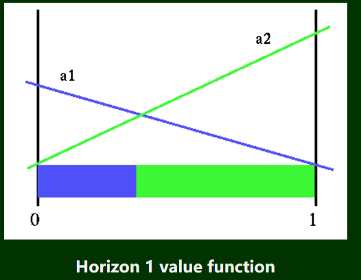

## 二  **Horizon=2**

现在我们有了Horizon=1的价值函数，我们再来看一下Horizon=2时值函数如何计算。

我们的目标是，如何在执行两步动作的情况下(即Horizon=2)，找到信念状态对应的最高奖励。

为了展示值函数的构造细节，我们由浅入深将其分解为三步：

1. **当a和z给定时**，如何计算belief的价值。
2. **当a给定时**，如何计算belief的价值。
3. **如何计算belief对应的真实值函数。**

------

### 1.当a和z给定时，如何计算belief的价值。

当Horizon=2时，由公式(1)知，**belief对应的价值=即时奖励+下一步动作带来的奖励**，即(**为了简化描述，我们省略折扣因子**)：
$$
V^{*}(b)=\max _{a \in A}\left\{\sum_{s \in S} b(s) R(s, a)+ \sum_{z \in Z} p(z \mid b, a) V_{Horizon=1}(\tau(b, a, z))\right\},
$$
其中，$V_{Horizon=1}$为上文在Horizon=1时计算出的最优值函数。

因此，想要获得belief对应的最佳值函数，我们需要考虑两个action组成的所有可能的执行序列(即考虑所有的策略，然后选取最优的策略)。如同Horizon=1的情况一样，我们可以简单的计算出第一步动作对应的**即时奖励**，即：$\sum_{s \in S} b(s) R(s, a)$.

因此，唯一的问题是，我们如何在给定belief(b),action(a),observation(z)的情况下，计算更新后信念状态(b')的最高价值是什么。事实上，由于$b,a,z$都是完全给定的，因此我们可以唯一确定$b'=\tau(b, a, z)$，而b'的**最高价值**由$V^{*}(b')=V_{Horizon=1}(b')$可以决定。

故在给定$a_1,z_1$的情况下，b对应的价值函数为：
$$
V^*(b,a_1,z_1)=\left\{\sum_{s \in S} b(s) R(s, a_1)+V_{Horizon=1}(\tau(b, a_1, z_1))\right\},
$$
因此，我们可以根据公式(7)来计算给定a,z时任意belief的价值

下图显示了此过程。左侧是**即时奖励函数**，右侧是Horizon=1的值函数。 动作$a_2$的立即奖励以虚线显示，因为在考虑给定动作$a_1$时，它不具备奖励。(假设我们给定的$a=a_1$)

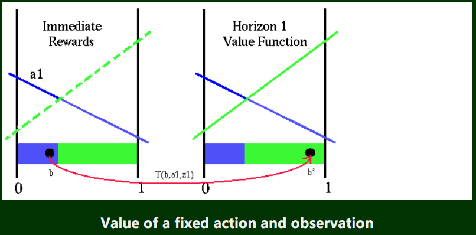

注意图中$T(b,a_1,z_1)=\tau(b, a_1, z_1)$，为信念状态转移函数。 请注意，通过查看b'的位置，我们可以立即确定执行操作$a_1$之后应该采取的最佳操作。 信念状态b'位于绿色区域中，这意味着，如果我们步长为2，并且首先采取动作$a_1$，那么我们之后的最佳策略就是采取行动$a_2$。

为了使得结构更加清晰，我们令$S(a_1,z_1)=V_{Horizon=1}(\tau(b, a_1, z_1))$，并画出$S(a_1,z_1)$的图像如下：

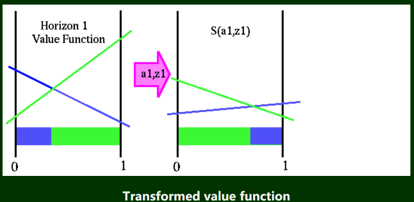

$S$函数可以帮助我们直接获得b对应的第二步的最高价值，而不需要经过两个函数变换(先将b变为b'，再根据$V_{Horizon=1}$计算b'价值)，原来的$V_{Horizon=1}$是b'的函数，而现在的$S$是b的函数。使用$S$函数的好处是：转换后的函数也是PWLC(Piecewise linear and convex)。

现在在任意给定$a_i,z_j$时，计算任意的belief的最高价值如下：
$$
V^*(b,a_i,z_j)=\left\{\sum_{s \in S} b(s) R(s, a_i)+S(b,a_i,z_j)\right\},
$$

------

### 2.当a给定时，如何计算belief的价值。

由于在POMDP中观测是具有概率性的，因此在执行完一个具体动作之后，会有多种可能的观测(我们无法确定是哪一个观测)，在这个例子中，有三种可能的观测${z_1,z_2,z_3}$，**任意一个观测都会导致独立的信念状态(即对不同的z，$\tau(b, a_1, z)$的结果可能是不同的)**，如下图所示：

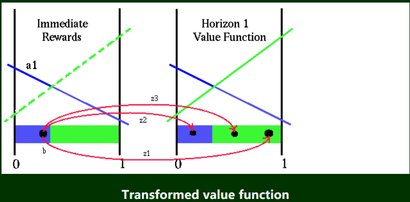

 对于给定的belief，**每个观察值都有与之相关的特定概率**。 如果我们知道给定观测值时belief的值(即公式(8))，则在不知道观测值的情况下获得belief的值**只是将每个结果值乘以该观测对应的概率进行加权的问题**。

因此，当我们只给定了动作而不知道观测时，我们应该考虑所有可能的观测，即在观测层面上，对给定$a,z$的价值函数进行加权即可，公式如下：
$$
V^{*}(b,a_i)=\left\{\sum_{s \in S} b(s) R(s, a_i)+ \sum_{z \in Z} p(z \mid b, a_i)S(b,a_i,z)\right\},\label{9}
$$
在这个例子中，对于动作$a_1$，我们需要计算在三种不同观测的情况下的S函数值，如下：

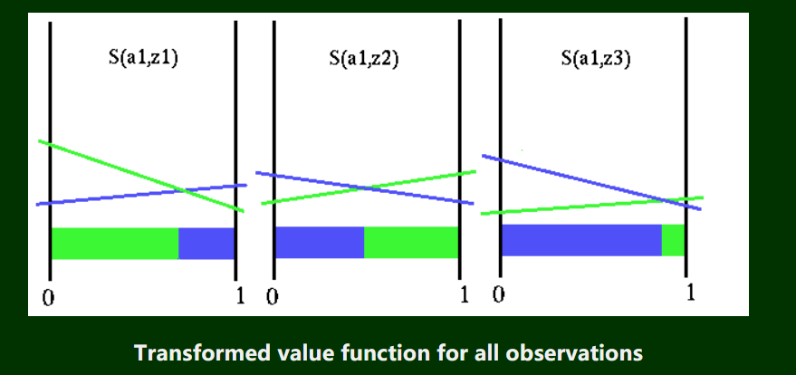

该图显示了动作$a_1$和所有三个观测值的$S$函数。 请注意，对于所有三个观测值,每个$S$函数都是不同的，且均对信念空间进行了不同的划分。所有这些暗示着，要执行的最佳下一个动作不仅取决于初始的信念状态，而且还取决于我们得到的观察结果，如下图所示，蓝色区域代表下一个最佳动作为$a_1$，绿色区域代表下一个最佳动作为$a_2$：

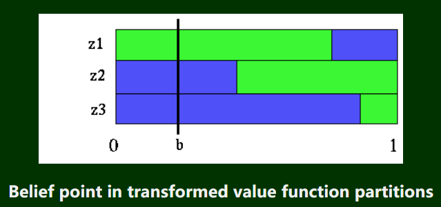

从上图可知：对信念状态b执行动作$a_1$​后，如果我们观察到$z_2$​或$z_3$​​，则下一步的最优动作为$a_1$​，否则下一步最优动作为$a_2$​​​。因此根据这个图，我们可以轻松的查看完整的最佳策略，且可以轻松的得到即时奖励$R(b,a_1)$​和$S(a_1,z_i)$​，从而得到$V(b)$​的值​。因此对于信念空间上的任意一个信念点b，我们都能画出对应的一条线，从而得出在信念点b下执行$a_1$​后的最优策略，例如此时的最优策略为$[z_1:a_2;z_2:a_1;z_3:a_1]$​​。

然而我们知道$[z_1:a_2;z_2:a_1;z_3:a_1]$只是当信念为$b$时的最优未来策略，它并不是整个信念空间上的最优策略，我们根据下图可以看出，$[z_1:a_2;z_2:a_1;z_3:a_1]$​​仅仅只是蓝色分区处所有信念点的最优未来策略：

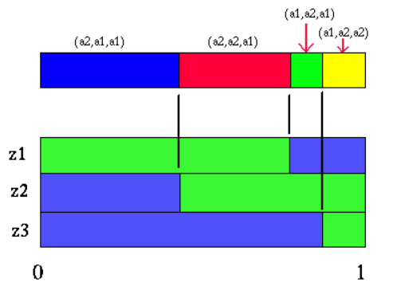

我们按照分区的不同，为四个具有不同最优未来策略的区域画出对应的价值函数$V(b,a_1)$(由公式$\eqref{9}$计算)如下：

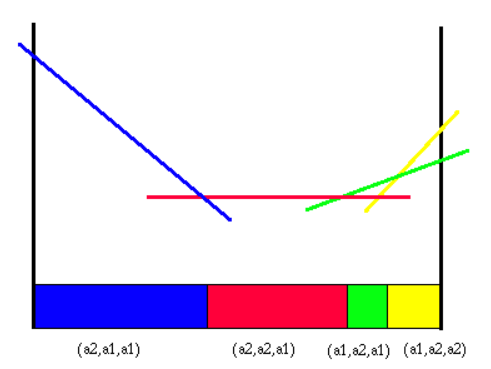

因此我们可以轻松的计算出$V^*(b,a_i)$​的值函数和最佳策略。

------

### 3.如何计算belief对应的真实值函数。

在2中，我们知道了如何在给定$b,a_1$​的情况下，得到未来的最优策略并计算$V^*(b,a_1)$​​。但是我们关心的不是$V^*(b,a_i)$而是$V^*(b)$的值，因此我们需要对$a_2$重复一遍2过程，得到$V^*(b,a_2)$的值函数和最佳策略如下图：

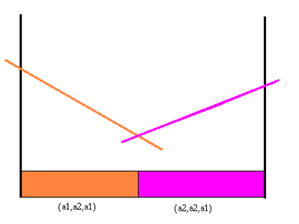

我们可以将两个动作的值函数结合在一起，选择具有更高价值的动作，如下图：

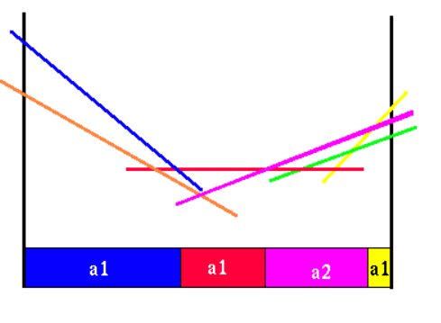

由于$V^*(b,a_1)$的蓝线大于$V^*(b,a_2)$，因此第一区域应该先执行动作$a_1$，再按$[z_1:a_2;z_2:a_1;z_3:a_1]$的最佳未来策略执行，剩下三个区域同理。我们可知对两个$V^*(b,a)$而言，其中总有价值更高线段，因此价值更低的线段会被舍弃，从而会产生更紧凑的Horizon=2的$V(b)$​函数。

------

## 三  **Horizon=3**

我们将把Horizon=2的情况拓展到Horizon=3的情况上来。我们首先画出Horizon=2的$V(b)$函数如下，值得注意的是其中每个颜色都代表不同的未来策略(在这个例子中，代表第二步应该执行的动作)：

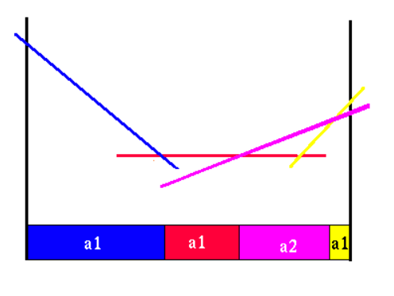

首先，我们依然是构造$V^*(b,a_1)$​的值函数(由公式$\eqref{9}$​计算，其中$S(a_1,z_1))=V_{Horizon=2}(\tau(b, a_1, z_1))$​如下：

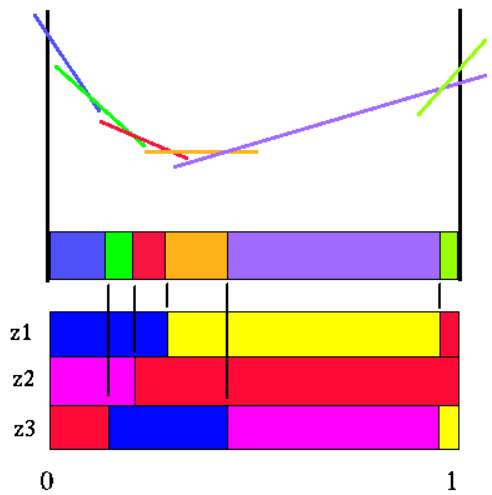

同样地，然后我们按照相同步骤构造$V^*(b,a_2)$​如下：

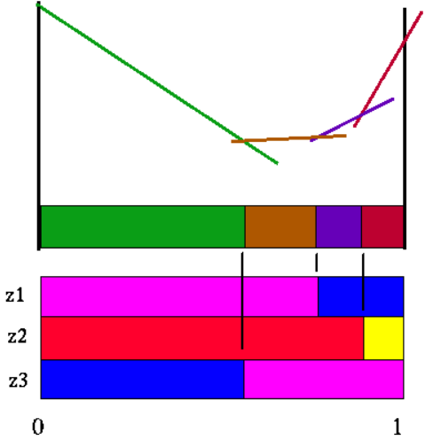

最后，我们将$V^*(b,a_1)$与$V^*(b,a_2)$结合到一张图上，确定好策略的分区：

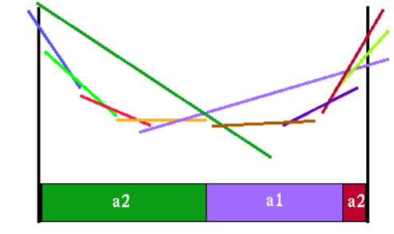

最终$V^*_{Horizon=3}(b)$函数如下：

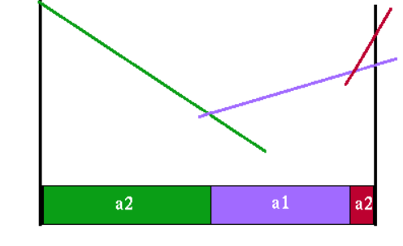

**我们可以对任意Horizon反复应用值迭代的方法构造$V^*_{Horizon=n}(b)$的值函数，注意到对$k<n,\forall a\in A$，$V^*_{Horizon=k}(b)$和$V^*(b,a)$都是分段线性凸函数，因此根据数学归纳法易证$V^*_{Horizon=n}(b)$​也是分段线性凸函数。**

