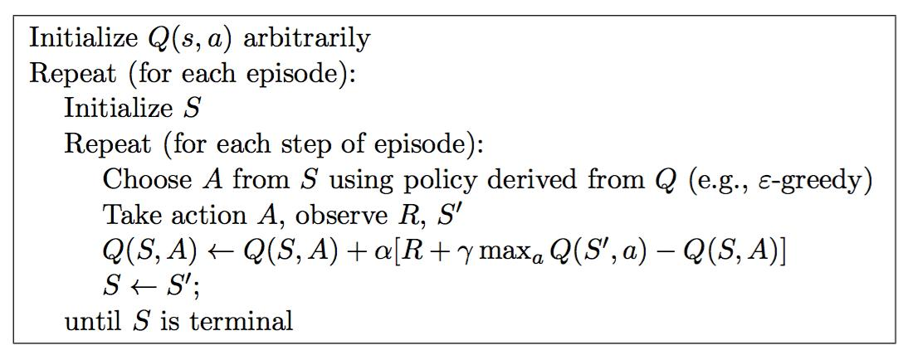

# Q-Learning

### Q-Learning在做什么？

它维护一个Q-Table，即一个表格，行为每个状态，列为每个动作，即维护一个动作价值函数$Q(s,a)$​，这个表格可以指导我们在状态为s的时候，应该选择哪个动作a使得奖励最高。

在RL中，如果我们有了真实$Q(s,a)$函数，那我们也就知道了应该如何选择动作，而在Q-Learning中，它把动作价值函数$Q(s,a)$以表格Q-Table的形式展现出来，所以我们可以根据真实的Q-Table来指导我们选择动作。

例如：

|       | $a_1$ | $a_2$ |
| ----- | ----- | ----- |
| $s_1$ | 0     | 1     |
| $s_2$ | 1     | 2     |

则当$s=s_1$时，我们应该选择动作$a_2$；$s=s_2$时，应该选择动作$a_2$。

### Q-Learning如何得到的真实Q-Table？

前面我们介绍了Q-Learning实际上就是在维护表格形式的$Q(s,a)$，那我们如何获得真实的$Q(s,a)$，即如何获得真实的Q-Table?

Q-Learning采用时间差分的优化方式，即:每当Agent走一步，$Q(s,a)$​即Q-Table就会被更新，而不是当Agent走完一整条轨迹(epsiode)之后再更新$Q(s,a)$​。

更新的方式为：$$Q(S,A)=Q(S,A)+\alpha(R+\gamma\max_a Q(S',a)-Q(S,A))$$

注意：可以理解为当前Agent在S下做出了动作A，得到了一个奖励R，那么根据Bellman方程我们可以得到一个新的对$Q(S,A)$​​的估计：$$Q_{new}(S,A)=R+\gamma\max_a Q(S',a)$$​​​。因此我们需要利用新的估计对原来旧的估计$Q_{old}(S,A)$​​做一个加权更新，即：

$$Q(S,A)=(1-\alpha)Q_{old}(S,A)+\alpha Q_{new}(S,A)$$​

#### 具体实现：

使用Q-learning玩gridwolrd，见同目录代码。

#### 参考：

1.Q-Learning[论文](https://link.springer.com/content/pdf/10.1007/BF00992698.pdf)

2.图源[时间差分学习](https://www.pianshen.com/article/22271097513/)

