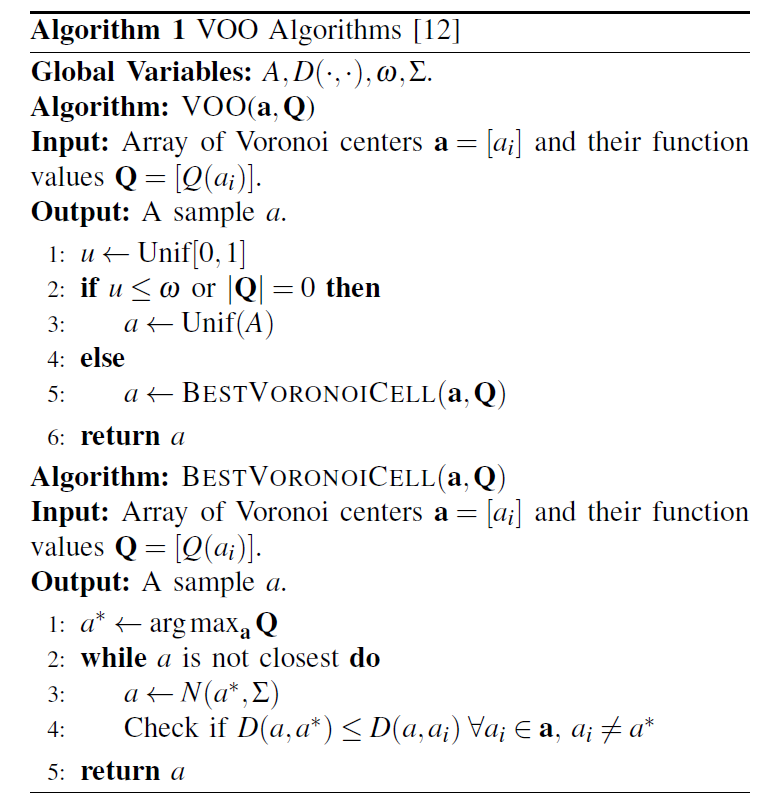
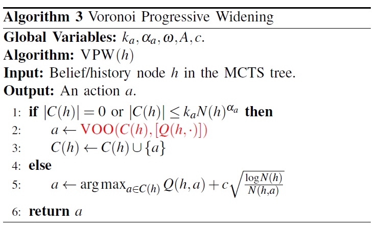
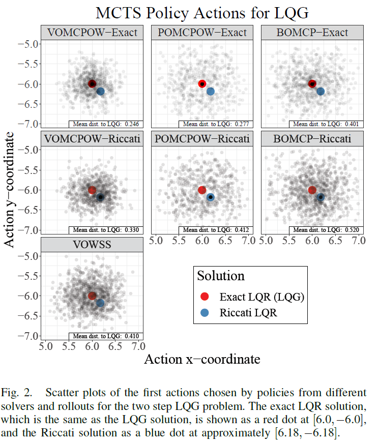
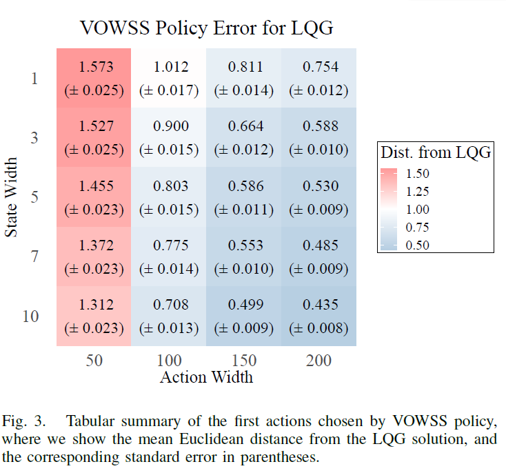
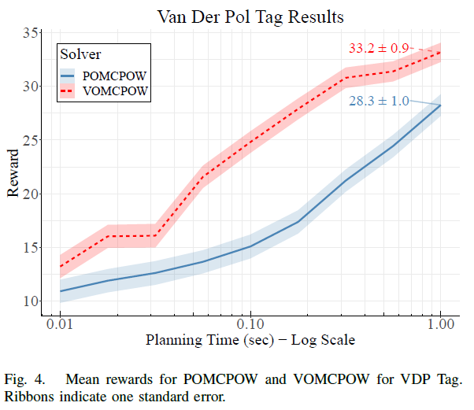
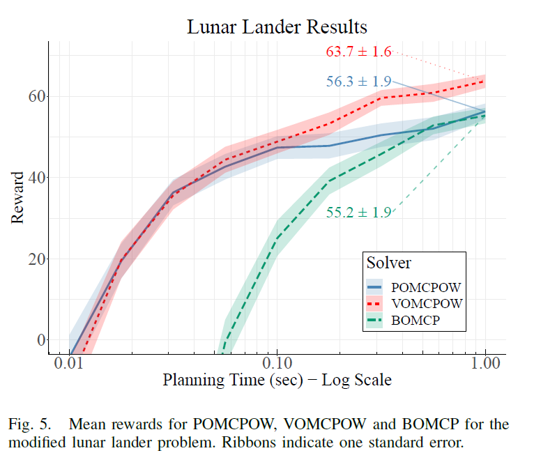

## VOMCPOW

#### 思路简介

处理连续动作空间的一个有效的方式是使用连续bandit来采样新动作，比如HOO和HOOT。作者基于此，将HOO迁移到POMDP问题中，提出了VOO用来处理连续bandit问题，并将VOO与POMCPOW算法做一个结合形成VPW完整算法。

### VOO

VOO是一种连续bandit算法，它通过将空间划分为 Voronoi 单元来自适应地探索采样空间，通过与其他中心相比最接近相应 Voronoi 中心的点集来定义 Voronoi 单元，最好的 Voronoi 单元是具有最高函数值估计中心的 Voronoi 单元。

**VOO以概率w均匀的搜索整个动作空间，或以概率1-w从最好的Voronoi 单元中搜索动作空间，其中BESTVORONOICELL 通过高斯拒绝采样从最好的 Voronoi 单元中采样一个动作**，算法如下。

### VPW 

 VPW综合了VOO和PW，实际上与POMCPOW完全类似，不同点在于VPW中动作选择由VOO完成，且需要引入一个距离度量D。

### VOMCPOW

用VPW替换POMCPOW的PW部分形成的算法，不再赘述。值得注意的是，作者给出了与POWSS对应的算法VOWSS的理论性保障，形式如下：
$$
\left|V_{d}^{\star}(b)-\hat{V}_{\text {VowSS }, d}(\bar{b})\right| \leq \eta_{C_{a}}+\alpha_{C_{s}}
$$
当$C_a$和$C_s$不断增大时，$\eta_{C_{a}}$和$\alpha_{C_{s}}$趋向于0。

### 实验部分

#### A. Linear Quadratic Gaussian

第一个实验是2D的带高斯噪声的线性控制系统，具体如下，其中x为状态，u为动作，v为状态的高斯噪声，y为观测，w为观测的高斯噪声：

**动态系统：**$$x_{t+1}=x_{t}+u_{t}+v_{t} ; y_{t}=x_{t}+w_{t} ; v_{t}, w_{t} \stackrel{\text { i.i.d. }}{\sim} N\left(0, \sigma^{2} I\right)$$​​

**Cost Function:**  $$J\left(x_{0}\right)=\mathbb{E}\left[x_{N}^{T} x_{N}+\sum_{t=0}^{N-1}\left(x_{i}^{T} x_{i}+u_{i}^{T} u_{i}\right)\right]$$​​​

这个动态系统可以得到理论上的最优解：$$u_{0}^{\star}=-K_{0} \hat{x}_{0}=-0.6 \cdot \hat{x}_{0}=[6.0,-6.0]$$

给定规划时间为0.1s，实验效果如图：

注意作者使用连续时间下的LQG最优解和离散时间下的Riccati解分别作为算法的rollout策略进行了测试，这样的目的是证明了POMCPOW和BOMCP难以获得最优解，因为在两种Rollout策略下，POMCPOW和BOMCP只能寻找到与Rollout策略接近的解，可以理解为其性能被Rollout策略所限制，而VOMCPOW在两种rollout策略下都能得到全局最优解，即VOMCPOW具有更高的求解精度，哪怕Rollout策略已经是表现高效的Riccati策略，VOMCPOW依然能找到更高效的策略。

作者额外在VOWSS上做了性能关于状态宽度$C_s$和动作宽度$C_a$的结果图如下，目的是为了证明$C_a$和$C_s$增大时，误差会不断减小从而趋向于0。

#### B.Van Der Pol Tag

实验设置与POMCPOW论文中的VDPTag设置相同，实验结果如下：

实验结果表明VOMCPOW在所有的规划时间上都比POMCPOW的效果要好。

作者没有测试BOMCP的性能，他认为BOMCP难以用于解决混合动作空间问题，这侧方面表明了VPW的易用性。

### C. Lunar Lander

Once again, we show the mean reward for 1000 simulations for each solver and each planning time plotted in log scale of seconds in Figure 5. VOMCPOW outperforms both POMCPOWand BOMCP by a statistically significant margin once the planning time exceeds 0.1 seconds. Below 0.1 seconds, the performances of POMCPOW and VOMCPOW are similar due to the problem having a long horizon, in which the effects of VPW will not be as apparent since best Voronoi cell actions will not be sampled very often.

与BOMCP中的问题设置一致，不再赘述，详细可见链接[文章](https://github.com/Lttcc/RL-POMDP/tree/main/%E8%BF%9E%E7%BB%AD%E5%8A%A8%E4%BD%9C%E7%A9%BA%E9%97%B4POMDP%E7%AE%97%E6%B3%95)中的介绍，实验结果如下：

一旦规划时间超过 0.1 秒，VOMCPOW 就以显着的优势优于 POMCPOW 和 BOMCP。 低于 0.1 秒，POMCPOW 和 VOMCPOW 的性能相似，因为问题具有较长的视野，其中 VPW 的影响不会那么明显，因为不会经常对最佳 Voronoi 单元动作进行采样。

### 总结

这篇文章把HOO迁移到连续动作空间问题上提出VOO算法，即通过采样动作价值作为Voronoi单元来指导在概率1-w下的动作选择，这利用的是动作价值函数的lipchitz性质，简单的可理解为：相似的动作的价值应该是相似的，且变化幅度是缓慢的。因此可以认为那些具有高价值的动作单元附近的动作也具有较高的价值，所以才会在这些动作单元附近使用拒绝采样来采样动作。

虽然VPW在这篇文章中给出了理论证明，但是VPW的实际效果和理论证明之间依然由很大的差距，而且通过实验的超参发现，w的设置往往比较大，例如在Lander问题中设置为0.9，即大部分的动作依然是从整个动作空间中选取的，只有少部分的动作会从最高价值单元附近进行采样，这说明采样动作时，依然不能倾向于采样价值更高的动作附近的动作，这可能是与动作的评估是非平稳的有关。

虽然VPW只需要提供一个距离度量就可以用来解决混合动作空间问题，但是距离度量的选择对性能的影响也是很大的，所以并没有作者说的那么好。

